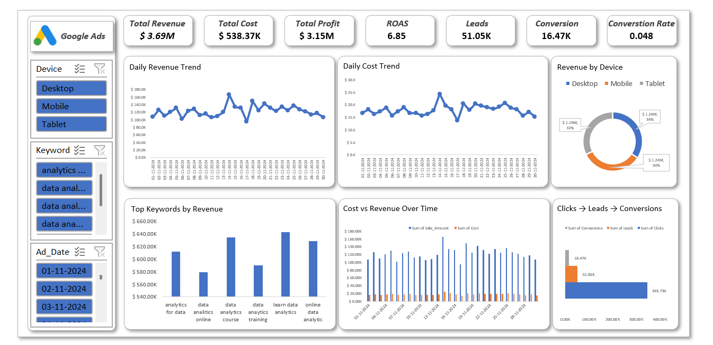

# Google-Ads-Sales-Data-Analysis
Excel Data Analysis Project using a Google Ads Sales Dataset. Performed data cleaning, transformation, KPI calculations, Pivot Table analysis, and dashboard creation to evaluate campaign performance, conversions, revenue, and ROAS.

# Google Ads Sales Dataset for Data Analytics Campaigns

## Project Overview

This project analyzes a simulated Google Ads campaign promoting Data Analytics courses.

The dataset intentionally contains:

- Missing values
- Typos
- Inconsistent formatting
- Mixed date formats
- Currency formatting issues

The goal is to demonstrate real-world data cleaning, analysis, visualization, and dashboard development skills using Excel.

---

## Dataset

### Raw Dataset

Contains uncleaned advertising data including:

- Ad_ID
- Campaign_Name
- Clicks
- Impressions
- Cost
- Leads
- Conversions
- Conversion Rate
- Sale_Amount
- Ad_Date
- Location
- Device
- Keywords

---

## Data Cleaning Performed

### Campaign Name Standardization

Examples:

- DataAnalyticsCourse
- Data Analytics Corse
- Data Analytcis Course

Converted to:

Data Analytics Course

### Location Standardization

Examples:

- HYDERABAD
- hyderabad
- Hyderbad

Converted to:

Hyderabad

### Cost & Revenue Cleanup

- Removed currency symbols
- Converted text to numeric values
- Replaced missing values

### Date Cleanup

Standardized mixed date formats.

### Conversion Rate

Recalculated using:

Conversion Rate = Conversions / Clicks

---

## KPI Metrics

- Total Revenue
- Total Cost
- Total Profit
- Total Clicks
- Total Leads
- Total Conversions
- Conversion Rate
- ROAS

---

## Dashboard Visualizations

- Revenue Trend
- Cost vs Revenue
- Revenue by Device
- Top Keywords by Revenue
- Top Keywords by Conversions
- ROAS Analysis

---

## Tools Used

- Microsoft Excel
- Power Query
- Pivot Tables
- Pivot Charts
- Slicers

---

## Key Insights

- Mobile generated the highest revenue.
- Certain keywords produced significantly higher ROAS.
- Revenue trends identified peak-performing days.
- Device-level analysis highlighted conversion differences.

---

## Dashboard Preview

---

## Author

Ayush Gupta

Aspiring Data Analyst
